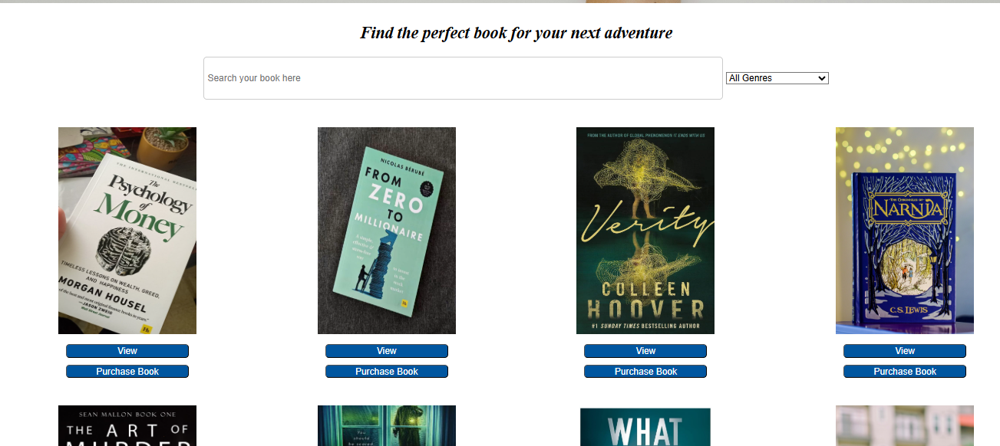
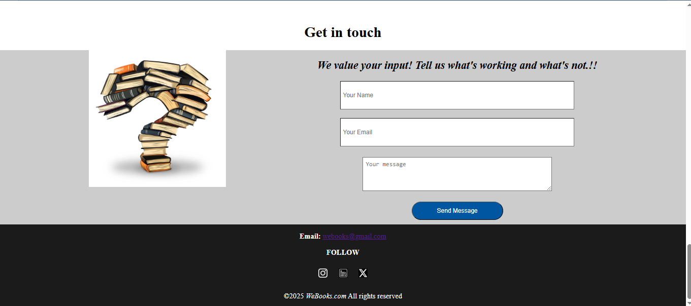

## WeBook Website
**Rochelle Awuor** -  Phase 1 Final Project 

## **Description**
WeBook is an online book marketplace where users can browse, view details, and purchase books. The platform allows users to search for books by title, filter by genre, and interact with a seamless book shopping experience.

## Screenshots 
 

 

 


## Setup Instructions 

### **Requirements**
- Before setting up the project, ensure you have the following installed:

    - JavaScript

    - Node.js & npm

    - JSON Server

    - Git

    - Text Editor (e.g., Visual Studio Code)

    - Web Browser

### Getting Started 
1. **Clone the repository**   
Open your terminal and run the following command:
    ```sh
    $git clone https://github.com/awuorochelle75/webook-website.git


2. **Navigate to the project folder**
    ```sh
        $cd webook-website

3. **Install dependencies**
    ```sh
        $npm install

4. **Start the JSON Server**
The JSON server simulates a backend API for fetching and updating book data. Run:
    ```sh
        $json-server --watch db.json

5.Run the Application

    - Open index.html in your web browser

    - You can also use Live Server if using VS Code

## **How to Use WeBook**
- Browse Books: View a collection of books displayed on the homepage.

- Search Books: Use the search bar to find books by title.

- Filter by Genre: Select a genre from the dropdown to filter books.

- View Book Details: Click on a book to see more details, including title, author, description, and price.

- Purchase Books: Click "Purchase" to buy a book, with a confirmation alert.


## Live Demo
🔗 Access the web application here:
https://webook-website.vercel.app/


## JSON Server (API Endpoints)
The app interacts with a local JSON server that acts as the backend. Here are the available API endpoints:
    ```sh
        GET /books        # Fetch all books
    ```sh
        GET /books/:id    # Fetch a single book by ID
        PATCH /books/:id  # Update book availability after purchase

## Technologies Used
- This project is built using:

    - HTML for structure

    - CSS for styling

    - JavaScript for interactivity

    - JSON Server for mock API

## Dependencies
Google (for external resources)

## Contact Information
📧 Email: awuorochelle@gmail.com

## License
📜 MIT License @2025 Rochelle Awuor

